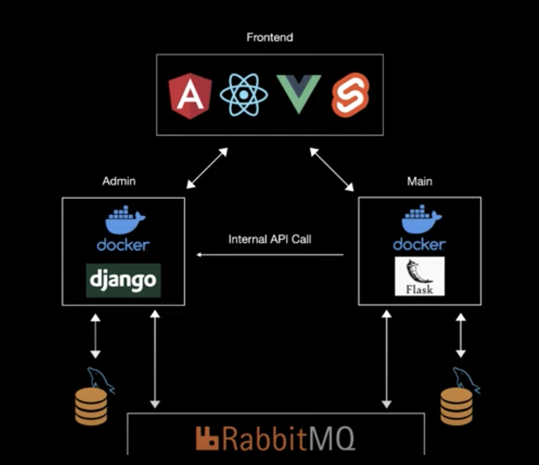
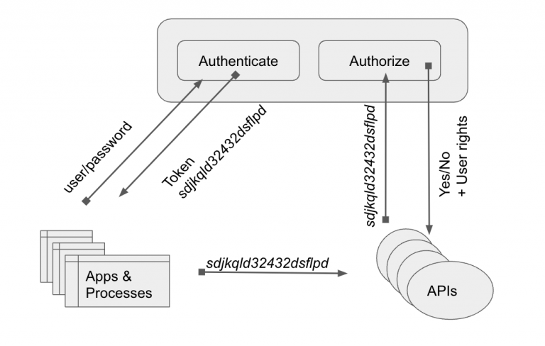

# Microservice Overview and Instructions

A microservices architecture offers several advantages over a monolithic application. With microservices the overall application is broken up into distinct services. This design allows for:
- Scaling of each microservice differently, such as search, payments, data science, etc.
- Separation of concerns
- Each team can work independently on their domain
- Mix of technologies - e.g., each service can be independently composed of Django, Flask, FastApi, Falcon, Javascript/Node etc.



# Microservices Architecture

Central to a microservices architecture is the authentication layer, which is needed for authentication, authorization, and provides overall identity access management.

Users are authenticated by tokens issued by the authentication layer. When a user logs in, the auth layer generates a signed token and returns it to the client. 


For every service that the client seeks to access, each microservice verifies the signature of the JWT token by using the same secret provided to sign the token. This verification is automatically done by Auth0, such that the secret key does not have to be distributed to every service.  



## Installation
### Requirements

This project only supports the [actively supported versions of Angular as stated in the Angular documentation](https://angular.io/guide/releases#actively-supported-versions). While other versions might be compatible they are not actively supported.

## Install
The auth0-angular libary is required. Using npm:

```sh
npm install @auth0/auth0-angular
```

There is also `ng-add` support, so the library can also be installed using the Angular CLI:

```sh
ng add @auth0/auth0-angular
```

### Configure the SDK

#### Static configuration

Install the SDK into your application by importing `AuthModule.forRoot()` and configuring with your Auth0 domain and client id, as well as the URL to which Auth0 should redirect back after succesful authentication:

```ts
import { NgModule } from '@angular/core';
import { AuthModule } from '@auth0/auth0-angular';

@NgModule({
  // ...
  imports: [
    AuthModule.forRoot({
      domain: 'YOUR_AUTH0_DOMAIN',
      clientId: 'YOUR_AUTH0_CLIENT_ID',
      authorizationParams: {
        redirect_uri: window.location.origin,
      },
    }),
  ],
  // ...
})
export class AppModule {}
```

#### Dynamic configuration

Instead of using `AuthModule.forRoot` to specify auth configuration, you can provide a factory function using `APP_INITIALIZER` to load your config from an external source before the auth module is loaded, and provide your configuration using `AuthClientConfig.set`.

The configuration will only be used initially when the SDK is instantiated. Any changes made to the configuration at a later moment in time will have no effect on the default options used when calling the SDK's methods. This is also the reason why the dynamic configuration should be set using an `APP_INITIALIZER`, because doing so ensures the configuration is available prior to instantiating the SDK.

> :information_source: Any request made through an instance of `HttpClient` that got instantiated by Angular, will use all of the configured interceptors, including our `AuthHttpInterceptor`. Because the `AuthHttpInterceptor` requires the existence of configuration settings, the request for retrieving those dynamic configuration settings should ensure it's not using any of those interceptors. In Angular, this can be done by manually instantiating `HttpClient` using an injected `HttpBackend` instance.

```js
import { AuthModule, AuthClientConfig } from '@auth0/auth0-angular';

// Provide an initializer function that returns a Promise
function configInitializer(
  handler: HttpBackend,
  config: AuthClientConfig
) {
  return () =>
    new HttpClient(handler)
      .get('/config')
      .toPromise()
      // Set the config that was loaded asynchronously here
      .then((loadedConfig: any) => config.set(loadedConfig));
}

export class AppModule {
  // ...
  imports: [
    HttpClientModule,
    AuthModule.forRoot(), // <- don't pass any config here
  ],
  providers: [
    {
      provide: APP_INITIALIZER,
      useFactory: configInitializer, // <- pass your initializer function here
      deps: [HttpBackend, AuthClientConfig],
      multi: true,
    },
  ],
  // ...
}
```

### Add login to your application

To log the user into the application, inject the `AuthService` and call its `loginWithRedirect` method.

```ts
import { Component } from '@angular/core';
import { AuthService } from '@auth0/auth0-angular';

@Component({
  selector: 'app-root',
  templateUrl: './app.component.html',
  styleUrls: ['./app.component.css'],
})
export class AppComponent {
  constructor(public auth: AuthService) {}

  loginWithRedirect() {
    this.auth.loginWithRedirect();
  }
```

By default the application will ask Auth0 to redirect back to the root URL of your application after authentication. This can be configured by setting the [redirectUri](https://auth0.github.io/auth0-angular/interfaces/AuthorizationParams.html#redirect_uri) option.

For more code samples on how to integrate the **auth0-angular** SDK in your **Angular** application, have a look at our [examples](https://github.com/auth0/auth0-angular/tree/master/EXAMPLES.md).

## API reference

Explore public API's available in auth0-angular.

- [AuthService](https://auth0.github.io/auth0-angular/classes/AuthService.html) - service used to interact with the SDK.
- [AuthConfig](https://auth0.github.io/auth0-angular/interfaces/AuthConfig.html) - used to configure the SDK.

## What is Auth0?

Auth0 helps you to:

* Add authentication with [multiple authentication sources](https://auth0.com/docs/identityproviders),
either social like **Google, Facebook, Microsoft Account, LinkedIn, GitHub, Twitter, Box, Salesforce, among others**,or
enterprise identity systems like **Windows Azure AD, Google Apps, Active Directory, ADFS or any SAML Identity Provider**.
* Add support for **[linking different user accounts](https://auth0.com/docs/link-accounts)** with the same user.
* Support for generating signed [JSON Web Tokens](https://auth0.com/docs/jwt) to call your APIs and
**flow the user identity** securely.
* Analytics of how, when and where users are logging in.
* Pull data from other sources and add it to the user profile, through [JavaScript rules](https://auth0.com/docs/rules).

